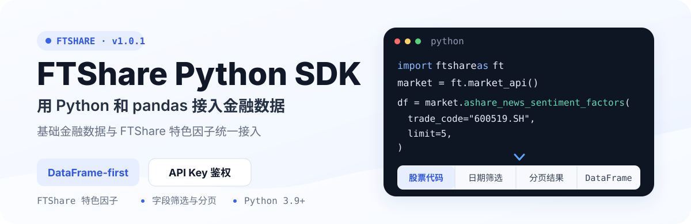
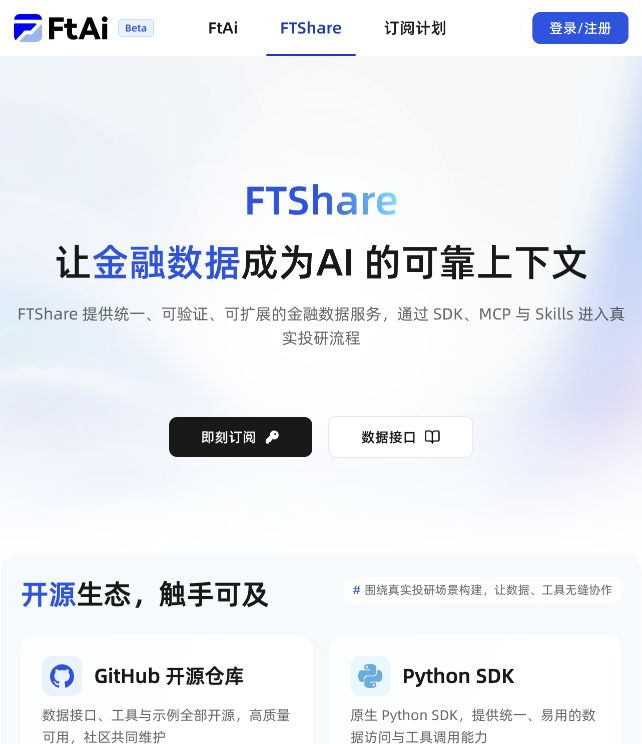

<p align="center">
  
</p>

<p align="center">
  <a href="https://github.com/FTShare-Lab/FTShare-python-sdk/releases/tag/v1.0.1"></a>
  <a href="https://www.python.org/downloads/"></a>
  <a href="https://github.com/FTShare-Lab/FTShare-python-sdk/blob/main/LICENSE"></a>
</p>

<p align="center">
  <strong>让金融数据成为 AI 的可靠上下文。</strong><br>
  FTShare 面向 AI Agent、量化研究和金融应用提供统一、可验证、可扩展的金融数据服务。
</p>

<p align="center">
  <a href="https://ftai.chat/?tab=ft-share"><strong>FTShare 正式版</strong></a>
  · <a href="https://ftai.chat/me/profile">获取 API Key</a>
  · <a href="https://market.ft.tech/gateway/doc/p/t5alo2h9">数据接口文档</a>
  · <a href="https://github.com/FTShare-Lab/FTShare-python-sdk/issues">问题反馈</a>
</p>

> [!IMPORTANT]
> FTShare 正式版已经发布。使用托管数据服务前，请先登录 FTShare 获取 API Key，并通过环境变量 `FTSHARE_API_KEY` 或 `market_api(api_key=...)` 配置鉴权。

## 先看它能做什么

`FTShare-python-sdk` 是 FTShare 的 Python 数据接入层。它将基础金融数据和 FTShare 特色因子统一成 Python 调用方式，默认返回 pandas `DataFrame`，可以直接进入分析、研究和应用开发流程。

<p align="center">
  <a href="https://ftai.chat/?tab=ft-share"></a>
</p>

<p align="center"><sub>FTShare 正式版公开页面。点击图片进入产品与套餐页面。</sub></p>

## 三步跑通第一次调用

### 1. 获取 API Key

登录 [FTShare 账号中心](https://ftai.chat/me/profile)，获取当前账号的 API Key。

### 2. 安装 SDK

当前从 GitHub 源码安装：

```bash
git clone https://github.com/FTShare-Lab/FTShare-python-sdk.git
cd FTShare-python-sdk
pip install -e .
```

### 3. 查询数据

```bash
export FTSHARE_API_KEY="your_api_key"
```

```python
import ftshare as ft

market = ft.market_api()

df = market.ashare_news_sentiment_factors(
    trade_code="600519.SH",
    start_date="20260801",
    end_date="20260831",
    limit=5,
)

print(df.head())
```

> [!NOTE]
> `ashare_news_sentiment_factors` 是 FTShare 的 A 股新闻情绪因子接口。它返回研究数据，不构成股票推荐或未来收益判断；具体字段和数据范围以当前接口文档与账号权限为准。

## 选择适合你的 FTShare 接入方式

| 接入方式 | 适合场景 | 返回或调用形态 | 仓库 |
|---|---|---|---|
| **Python SDK** | Python 程序、数据分析、量化研究 | pandas `DataFrame`、Python rows、原始 JSON | 当前仓库 |
| **MCP** | 支持 MCP 的 AI 客户端与 Agent | 标准 MCP 工具、结构化结果 | [FTShare-MCP](https://github.com/FTShare-Lab/FTShare-MCP) |
| **Skill** | Claude Code、Codex、OpenClaw 等 Agent 运行时 | 自然语言到数据接口的路由 | [FTShare-skill](https://github.com/FTShare-Lab/FTShare-skill) |

三种方式连接同一套 FTShare 金融数据服务。SDK 适合稳定编程，MCP 适合标准 Agent 工具调用，Skill 适合由 Agent 理解问题并选择数据接口。

## 为什么使用 Python SDK

- **DataFrame-first：** 默认返回 pandas `DataFrame`，减少重复的数据转换工作。
- **统一入口：** 通过 `ft.market_api()` 创建客户端，同时接入基础金融数据与 FTShare 特色因子。
- **多种返回形态：** 支持 DataFrame、Python 行数据与原始 JSON。
- **字段与分页：** 支持字段筛选、分页和多页拉取。
- **明确异常：** 区分 HTTP、JSON 解析和服务端业务错误。
- **可复用底座：** 可用于研究脚本、数据应用、MCP 工具和 Agent 工作流的数据接入层。

## 常用客户端配置

```python
import ftshare as ft

# 默认从 FTSHARE_API_KEY 环境变量读取
market = ft.market_api(timeout=20)

# 也可以显式传入
market = ft.market_api(api_key="your_api_key", timeout=20)
```

自定义 Base URL：

```python
market = ft.market_api(
    base_url="https://market.ft.tech/gateway/",
    timeout=20,
)
```

## 返回类型

默认返回 DataFrame：

```python
df = market.ashare_news_sentiment_factors(
    trade_code="600519.SH",
    limit=10,
)
```

返回 Python 行数据：

```python
rows = market.ashare_news_sentiment_factors(
    trade_code="600519.SH",
    limit=10,
    as_dataframe=False,
)
```

返回服务端完整 JSON：

```python
payload = market.ashare_news_sentiment_factors(
    trade_code="600519.SH",
    limit=10,
    raw=True,
)
```

## 分页与结果控制

```python
df = market.ashare_news_sentiment_factors(
    trade_code="600519.SH",
    page=1,
    page_size=20,
)
```

```python
df = market.ashare_news_sentiment_factors(
    trade_code="600519.SH",
    all_pages=True,
    max_pages=3,
)
```

详细的接口参数、字段与专题说明请查看 [FTShare 数据接口文档](https://market.ft.tech/gateway/doc/p/t5alo2h9)。

## 错误处理

```python
from ftshare import (
    FtshareAPIError,
    FtshareDecodeError,
    FtshareHTTPError,
)
```

- `FtshareHTTPError`：HTTP 状态码不是 2xx。
- `FtshareDecodeError`：响应不是合法 JSON。
- `FtshareAPIError`：服务端返回业务错误。

## 开发与测试

```bash
git clone https://github.com/FTShare-Lab/FTShare-python-sdk.git
cd FTShare-python-sdk
pip install -e ".[test]"
python3 -m pytest
```

真实接口集成测试默认跳过：

```bash
FTSHARE_RUN_INTEGRATION=1 python3 -m pytest tests/test_integration_market.py
```

## 开源代码与数据服务边界

本仓库代码采用 MIT License。开源许可证覆盖本仓库代码，不自动包含 FTShare 托管数据服务的访问额度、数据授权、再分发权或商业数据使用权；相关范围以产品页面和服务条款为准。

## 社区与反馈

- 使用问题与功能建议：[GitHub Issues](https://github.com/FTShare-Lab/FTShare-python-sdk/issues)
- 正式产品与套餐：[FTShare](https://ftai.chat/?tab=ft-share)
- API Key 管理：[账号中心](https://ftai.chat/me/profile)
- MCP 接入：[FTShare-MCP](https://github.com/FTShare-Lab/FTShare-MCP)
- Agent Skill：[FTShare-skill](https://github.com/FTShare-Lab/FTShare-skill)

### 加入 FTShare 社区交流群

欢迎加入 FTShare 社区交流群，讨论 Python SDK、特色因子、金融数据接口、MCP、Skill 和 Agent 使用。

<p align="center">
  
</p>

> 群内用于交流使用经验和补充问题信息；Bug、功能需求和接口问题建议优先通过 GitHub Issues 提交，便于公开跟踪和沉淀。

**二维码有效期至 2026 年 9 月 9 日。** 如二维码失效，请在 Issues 中留言。

---

<p align="center">
  <strong>FTShare</strong> · 让金融数据成为 AI 的可靠上下文
</p>
